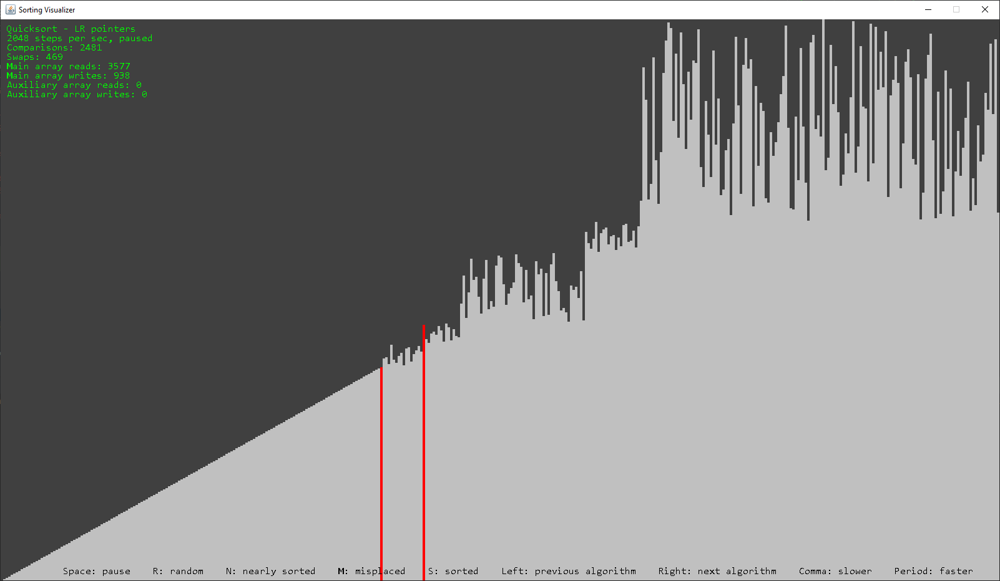

# SortingVisualizer
This is a small Java library for visualizing sorting algorithms, designed to be a quick and easy-to-use tool. You can
use it to investigate the behavior of various algorithms when given a random array, sorted array, or nearly sorted
array. You can define custom algorithms and have them be displayed. It is suitable for any algorithm that can operate on
an array of integers.



## Usage
Create an instance of `SortingVisualizer`, specifying the array size, the element width in pixels, and the window
height. The window width will be the array size times the element width. Then call `start()` followed by
`waitForExit()`, and the visualization will appear.

```java
public class Example {
    public static void main(String[] args) {
        SortingVisualizer visualizer = new SortingVisualizer(400, 4, 900);
        visualizer.start();
        visualizer.waitForExit();
    }
}
```

### Controls
The application is controlled by a few keyboard commands:
- R: randomly shuffle the array
- N: shuffle the array such that it is nearly sorted
- M: shuffle the array such that only a few elements are misplaced
- S: sort the array
- Left: previous algorithm
- Right: next algorithm
- Space: pause visualization
- Comma: decrease visualization speed
- Period: increase visualization speed

### Custom algorithms
Algorithms are defined by extending `Algorithm`. The implementation goes in `execute`, and you can optionally override
`isPointOfInterest` to highlight certain indices. A few convenience methods are provided:

- `get` - Gets an element of the array.
- `swap` - Exchanges two elements with each other.
- `compare` - Compares two elements, returning a value less than, equal to, or greater than zero.
- `awaitStep` - Blocks the thread until the visualizer sends a step signal. Use this to animate the algorithm. If the
thread is interrupted, it should stop execution and return.

An instance of your algorithm can then be added by calling `addAlgorithm` on your visualizer object before calling
`waitForExit()`.

```java
public class InsertionSort extends Algorithm {
    private int i;
    private int j;

    public InsertionSort() {
        super("Insertion sort");
    }
    
    protected void execute(int[] arr) {
        for(i = 1; i < arr.length; i++) {
            try { awaitStep(); } catch(InterruptedException e) { return; }
            for(j = i; j > 0 && compare(arr, j, j - 1) < 0; j--) {
                try { awaitStep(); } catch(InterruptedException e) { return; }
                swap(arr, j, j - 1);
            }
        }
    }
    
    public boolean isPointOfInterest(int index) {
        return index == i || index == j;
    }
}
```

## License
This is free and unencumbered software released into the public domain. Feel free to use it however you wish.